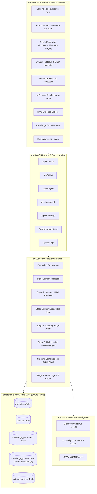

# System Architecture & Technical Specification

## AI Response Validation & Quality Intelligence Platform (Infosys Internship)

### 1. High-Level Architecture Overview

The platform is designed as an enterprise-grade AI Quality Intelligence and Evaluation system. It implements a multi-agent validation pipeline where specialized agents evaluate individual dimensions of response quality and cross-reference claims against authoritative ground truth retrieved from a RAG knowledge base.

---

### 2. Core Subsystems

#### 2.1 Evaluation Orchestrator (`src/lib/agents/orchestrator.ts`)
- Coordinates multi-stage evaluation pipeline.
- Emits real-time progress events for the UI.
- Gathers evidence, executes judge agents in logical sequence, applies critical verdict overrides, and saves audit trails in SQLite.

#### 2.2 RAG Knowledge Base (`src/lib/rag/`)
- **Benchmark Ingestion:** Preloaded with TruthfulQA (common misconceptions, health, physics, law) and SQuAD (Apollo lunar landing, Transformer architectures, photosynthesis).
- **Chunking Engine:** Sliding-window text chunker with configurable word counts (default: 60 words) and overlap (15 words) to preserve semantic boundaries.
- **Vector Representation:** Multi-dimensional term-frequency vectors combined with sub-word character tri-gram projections for typo-resilient semantic matching.
- **Retriever:** Cosine similarity search ranking top-K passages with similarity thresholds.

#### 2.3 Multi-Agent Judge Subsystem (`src/lib/agents/`)
1. **Relevance Judge:** Checks query intent coverage, opening sentence directness, and detects paragraph-level topic drift.
2. **Accuracy Judge:** Grounded comparison against reference answer and retrieved RAG context; categorizes into Correct, Partially Correct, Incorrect, and Contradiction.
3. **Hallucination Detection Agent:** Decomposes responses into atomic claims, maps character spans for interactive highlighting, assigns severity (Low, Medium, High, Critical), and flags ungrounded fabrications.
4. **Completeness Judge:** Decomposes queries into required facets and checks whether each is Addressed (✓), Partially Addressed (⚠), or Missing (✕).
5. **Verdict Agent:** Calculates weighted score (default 20/35/25/20), applies Critical Override rules if severe hallucinations exist, and formulates strengths, weaknesses, and recommendations.

#### 2.4 Persistence Layer (`src/lib/db/`)
- SQLite database configured with Write-Ahead Logging (`WAL` mode) for concurrent reads and writes.
- Normalized tables: `evaluations`, `batches`, `knowledge_documents`, `knowledge_chunks`, and `platform_settings`.
- Auto-seeds realistic benchmark evaluations on first run for interview demonstration readiness.

#### 2.5 Report Generation (`src/lib/pdf/generateReport.ts`)
- Professional client and server PDF generation using `jspdf` and `jspdf-autotable`.
- Produces executive-ready single evaluation audit reports and batch benchmark summary reports with metadata, KPI scorecards, auto-formatted tables, claim breakdowns, and coaching recommendations.
